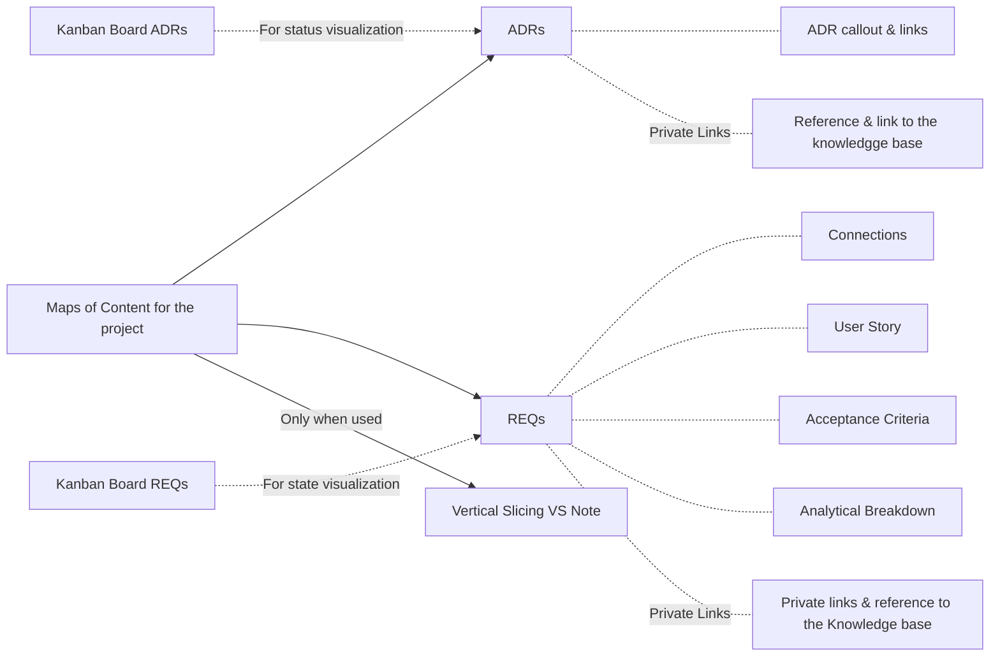

``` dataview
TABLE WITHOUT ID regexreplace(file.name, "^.*?-(\\d+)_.*$", "$1") AS "ID",  link(file.path, regexreplace(file.name, "^.*?\d+[_ \-]*", "")) AS "Vertical Slicing Documentation", Description 
	FROM "Projects/Traceability_System_Obsidian/docs/architecture"
	WHERE contains(file.name, "VS") AND status != "5-Deprecated"
	SORT regexreplace(file.name, "^.*?-(\\d+)_.*$", "$1") 

```

``` dataview
TABLE WITHOUT ID regexreplace(file.name, "^.*?-(\\d+)_.*$", "$1") AS "ID", link(file.path, regexreplace(file.name, "^.*?\d+[_ \-]*", "")) AS "Requisite", Description
FROM "Projects/Traceability_System_Obsidian/docs/requirements"
WHERE contains(file.name, "TSO-REQ") AND !endswith(file.name, "Analytical_Breakdown" ) AND status != "5-Deprecated"
SORT regexreplace(file.name, "^.*?-(\\d+)_.*$", "$1") 
```

```dataview
TABLE WITHOUT ID regexreplace(file.name, "^.*?-(\\d+)_.*$", "$1") AS "ID Number", link(file.path, regexreplace(file.name, "^.*?\d+[_ \-]*", "")) AS "Architectural Decision", Description
FROM "Projects/Traceability_System_Obsidian/docs/architecture"
WHERE contains(file.name, "TSO-ADR") AND !endswith(file.name, "Analytical_Breakdown" )
```


```dataview
TABLE WITHOUT ID regexreplace(file.name, "^.*?-(\\d+)_.*$", "$1") AS "ID Number", link(file.path, regexreplace(file.name, "^.*?\d+[_ \-]*", "")) AS "Architectural Decision", Description
FROM "Projects/Traceability_System_Obsidian/docs/architecture"
WHERE contains(file.name, "TSO-ADR") AND !endswith(file.name, "Analytical_Breakdown" )
SORT regexreplace(file.name, "^.*?-(\\d+)_.*$", "$1") DESC LIMIT 1
```
