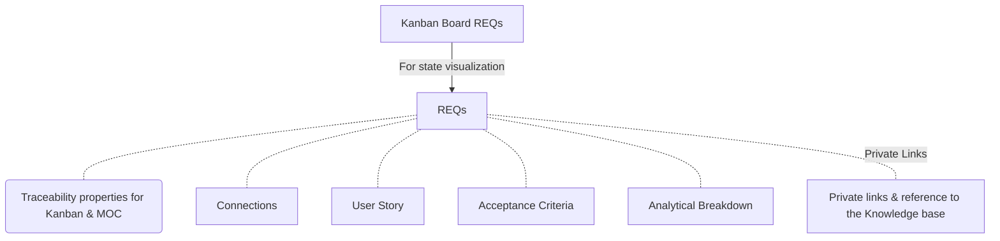

## Connections

| Type                | Route                                                                                                                                                                                                                                                                                                                                                                                                                                                                                                                                                                                                                                           |
| ------------------- | ----------------------------------------------------------------------------------------------------------------------------------------------------------------------------------------------------------------------------------------------------------------------------------------------------------------------------------------------------------------------------------------------------------------------------------------------------------------------------------------------------------------------------------------------------------------------------------------------------------------------------------------------- |
| **📕Architecture**  | `md` [TSO-ADR-003_Global_Functional_File_Connection](TSO-ADR-003_Global_Functional_File_Connection.md)    [ ] Bases Plugin [ ] Bases view                                                                                                                                                                                                                                                                                                                                                                                                                                                                                                    |
| 📓 **Requirements** | `md` [TSO-REQ-007_Template_Acceptance_Criteria](TSO-REQ-007_Template_Acceptance_Criteria.md)  `md` [TSO-REQ-013_Analytical_Breakdown_Artifact](TSO-REQ-013_Analytical_Breakdown_Artifact.md)  `md` [TSO-REQ-018_Links_to_code_and_prototypes_from_REQs](TSO-REQ-018_Links_to_code_and_prototypes_from_REQs.md)  `md` [TSO-REQ-006_Template_User_Stories](TSO-REQ-006_Template_User_Stories.md)  `md` [TSO-REQ-011_Properties_For_Requisite_Traceability](TSO-REQ-011_Properties_For_Requisite_Traceability.md)  `md` [TSO-REQ-020_Automatic_Link_Refactor_Script](../requirements/TSO-REQ-020_Automatic_Link_Refactor_Script.md) |

## Diagram

