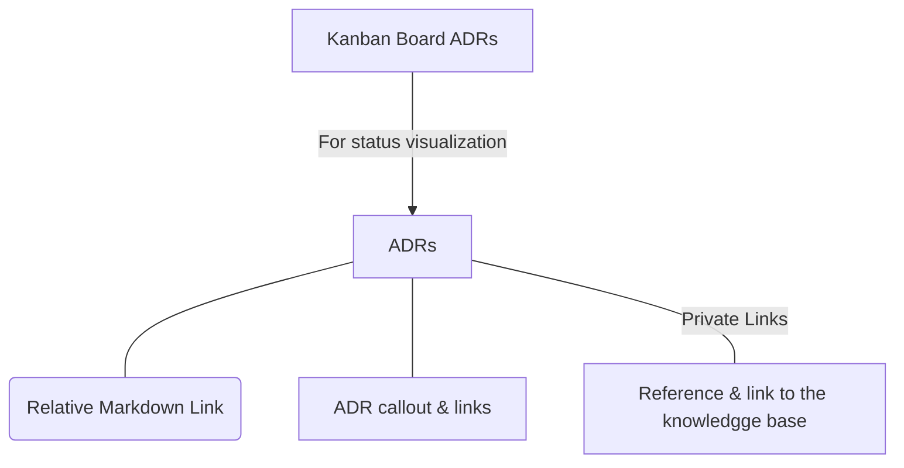

## Connections

| Type                | Route                                                                                                                                                                                                                                                                                                                                       |
| ------------------- | ------------------------------------------------------------------------------------------------------------------------------------------------------------------------------------------------------------------------------------------------------------------------------------------------------------------------------------------- |
| **📕Architecture**  | `md` [TSO-ADR-003_Global_Functional_File_Connection](TSO-ADR-003_Global_Functional_File_Connection.md)                                                                                                                                                                                                                                      |
| 📓 **Requirements** | `md` [TSO-REQ-008_Template_Structure_ADR's](../requirements/TSO-REQ-008_Template_Structure_ADR's.md)   `md` [TSO-REQ-012_Properties_For_ADR's_Traceability](../requirements/TSO-REQ-012_Properties_For_ADR's_Traceability.md)  `md` [TSO-REQ-019_Kanban_Dashboard_For_ADRs](../requirements/TSO-REQ-019_Kanban_Dashboard_For_ADRs.md) |

## Diagram

