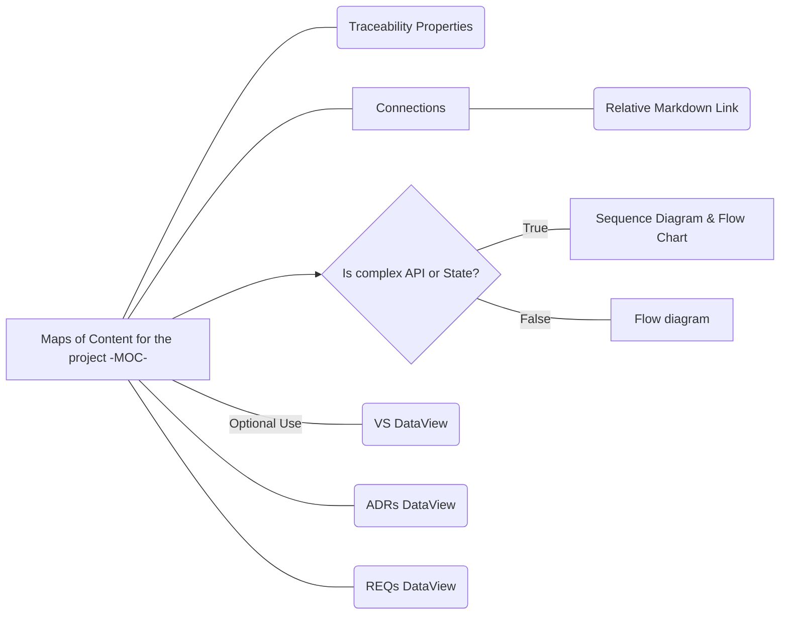

## Diagram

```mermaid
graph LR

MOC[Maps of Content for the project -MOC-]

%% Conections

MOC --- traceabilityProps(Traceability Properties)
MOC --- connections[Connections]
connections --- relativeLink(Relative Markdown Link)


%% Architecture
MOC --> diagramCondition{Is complex API or State?}
 diagramCondition --- |True| sequenceDiagram[Sequence Diagram & Flow Chart] 
 diagramCondition --- |False| flowDiagram[Flow diagram]

%% Main Automatic Mapping
MOC ---|Optional Use| VS(VS DataView)
MOC --- ADRs(ADRs DataView)
MOC --- REQs(REQs DataView)


```
