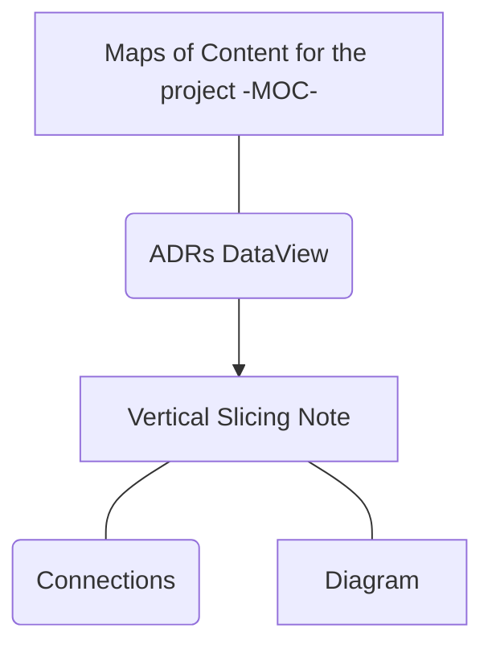

## Connections

| Type                | Route                                                                                                                                                                                                                                                |
| ------------------- | ---------------------------------------------------------------------------------------------------------------------------------------------------------------------------------------------------------------------------------------------------- |
| **📕Architecture**  |                                                                                                                                                                                                                                                      |
| 📓 **Requirements** | `md` [TSO-REQ-017_Vertical_Slicing_Note_Structure_Template](../requirements/TSO-REQ-017_Vertical_Slicing_Note_Structure_Template.md) `md` [TSO-REQ-021_Vertical_Slicing_MOC_Template_&_Properties](../requirements/TSO-REQ-021_Vertical_Slicing_MOC_Template_&_Properties.md) |
## Diagram

