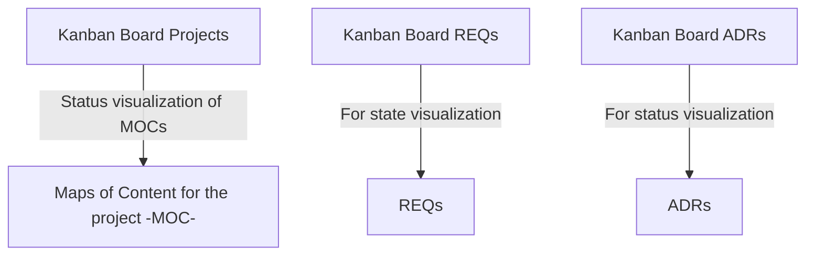

## Connections

| Type                | Route                                                                                                                                                                                                                                                           |
| ------------------- | --------------------------------------------------------------------------------------------------------------------------------------------------------------------------------------------------------------------------------------------------------------- |
| **📕Architecture**  |                                                                                                                                                                                                                                                                 |
| 📓 **Requirements** | [TSO-REQ-004_Kanban_Board_REQs](../requirements/TSO-REQ-004_Kanban_Board_REQs.md) [TSO-REQ-016_Kanban_Projects](../requirements/TSO-REQ-016_Kanban_Projects.md) [TSO-REQ-019_Kanban_board_For_ADRs](../requirements/TSO-REQ-019_Kanban_board_For_ADRs.md) |

## Diagram

